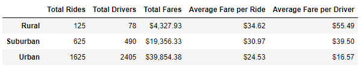
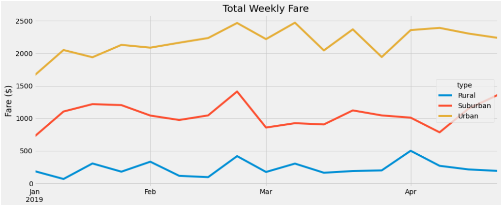

# Pyber Analysis

## Overview of the analysis
The purpose of this exploratory analysis is to provide Pyber a ride-share data analysis to help the company make decisions to improve access and affordability to ride-sharing services in undersourced neighborhoods. 

## Results
The results will consist of finding the differences in ride-sharing data between city types. This will be done by creating dataframes and visualizations of the dataset.

The data shows that urban neighborhoods have the highest availability of rides (1625) and drivers (2405) at a more affordable fare ($24.53). 

As we look out to the surrounding neighborhoods of suburban and rural communities, the rides and driver availability decrease while the fare increases. The rural neighborhoods have the lowest Rides (125) and drivers (78) at a more expensive fare ($34.62).

The line chart below works as a great visual aid in showing the major differences in the ride-share data between neighborhoods.

## Summary
According to this analysis the results show that there is a huge disparaty of ride-share services available in the rural community compareed to the urban community. Three recommedations are as followed:

1. Pyber should implement a loyalty program for the rural neighborhood. To incentivize ride-share service in the rural neighborhoods to keep customers using the ride-share service as well as drivers to be readily available. 

2. The analysis should include a more deeper look into demographics such as gender, age, and marital status. This will give the company a better idea of who are the drivers and riders.

3. Extend the analysis to include the whole year to foresee a seasonal trend of ride-share behavior.